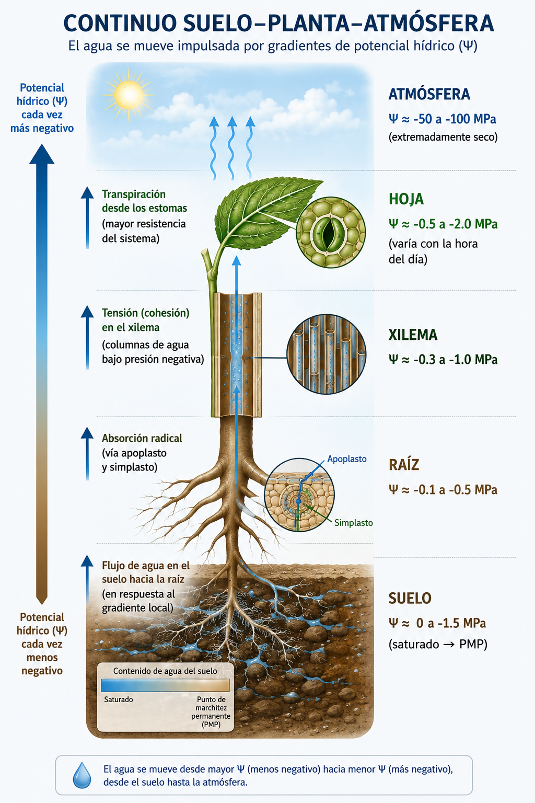
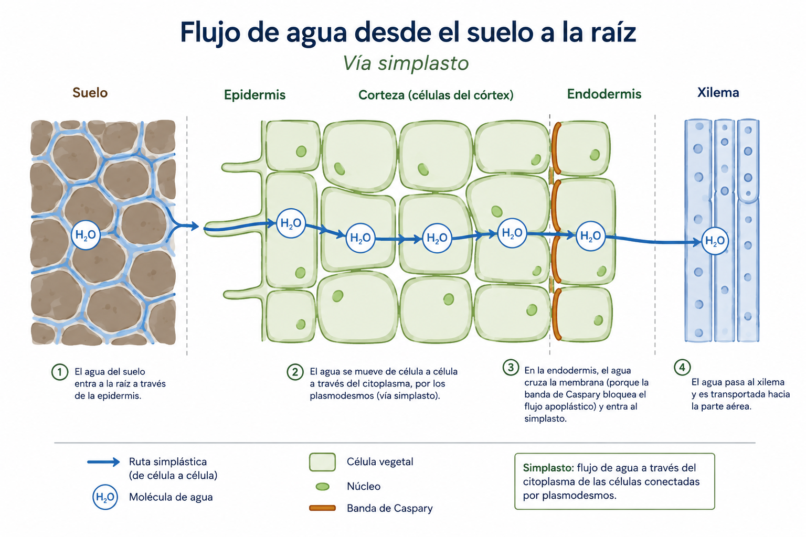
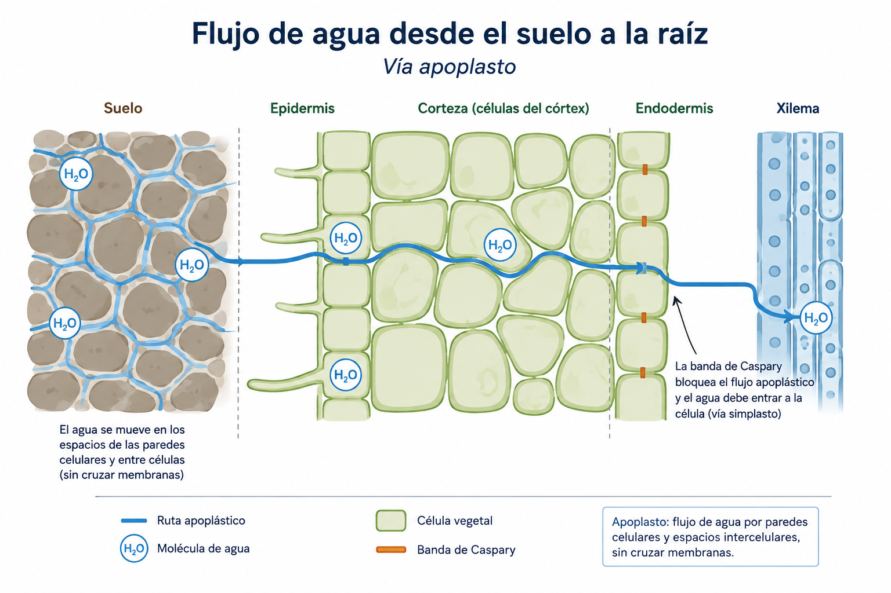
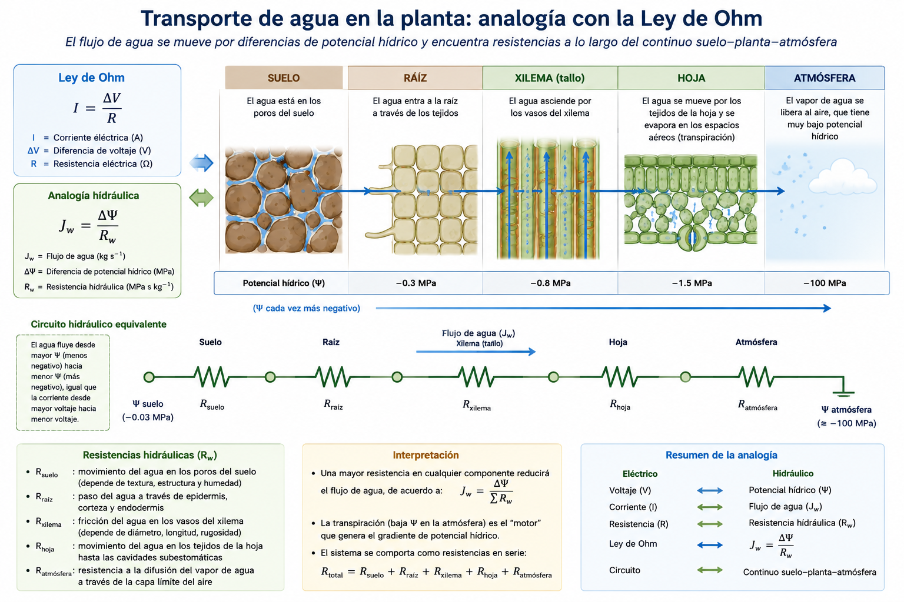
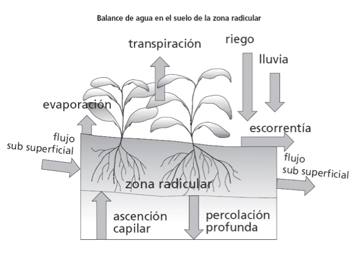
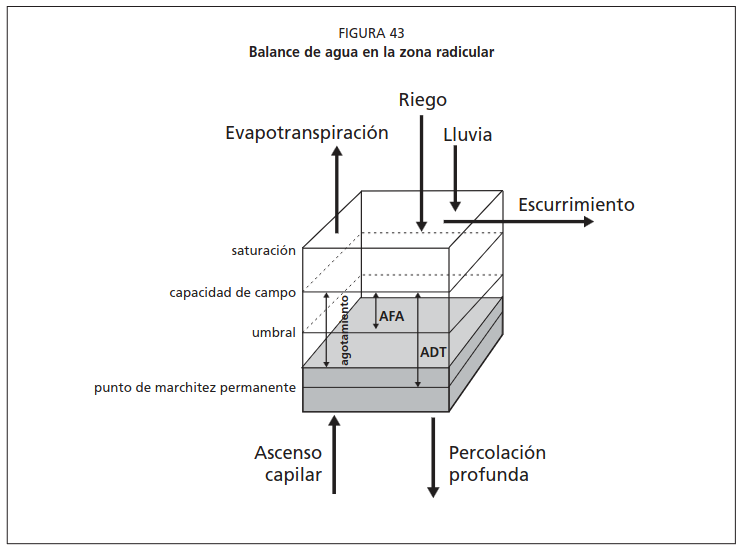

## Recapitulación sesión anterior {.center}

::: {style="font-size: 0.85em;"}
**Sesión 1.1 — Ideas fuerza:**  
1. El agua es una molécula polar con propiedades excepcionales  
2. El ciclo hidrológico define la disponibilidad de agua en cada zona  
3. En Chile, la agricultura consume >80% del agua — principalmente en la zona central  
4. La huella hídrica mide cuánta agua "cuesta" producir cada cultivo  
5. Chile exporta ~11,000 millones de m³ de agua virtual al año  

**Hoy:** ¿Cómo se mueve el agua dentro del sistema? → El SPAC
:::

---

## Información de la sesión {.center}

::: {style="font-size: 0.9em;"}
| | |
|---|---|
| **Unidad** | 1 — El agua en la producción agrícola |
| **Sesión** | 1.2 |
| **RAA** | RAA1 |
| **Duración** | ~90 minutos |
| **Contenido** | Continuo suelo-planta-atmósfera, gradientes de potencial, introducción al riego |
:::

---

## Objetivos de aprendizaje {.center}

Al finalizar esta sesión, serás capaz de:

1. Describir el concepto de continuo suelo-planta-atmósfera (SPAC)
2. Explicar cada componente del potencial hídrico total
3. Identificar los valores típicos de potencial en cada compartimento del SPAC
4. Comprender por qué el agua se mueve del suelo a la atmósfera
5. Aplicar los fundamentos del riego: ¿por qué, cuándo y cuánto regar?

---

## El continuo suelo-planta-atmósfera (SPAC) {.center .smaller}

::: {style="text-align: center; font-size: 0.85em;"}
**S**oil — **P**lant — **A**tmosphere **C**ontinuum
:::

:::: {.columns}

::: {.column width="40%"}

{width="80%" fig-align='center'}

:::

::: {.column width="60%"}

**Principio fundamental del SPAC**

> **El agua SIEMPRE se mueve de mayor a menor potencial hídrico.**

::: {style="margin-top: 1em; font-size: 0.9em;"}
El gradiente de Ψ en el SPAC:

$$
\begin{aligned}
&\text{Suelo (-0.03 MPa)} \rightarrow \text{Raíz (-0.3 MPa)} \rightarrow \text{Xilema (-0.8 MPa)} \\
&\rightarrow \text{Hoja (-1.5 MPa)} \rightarrow \text{Atmósfera (-100 MPa)}
\end{aligned}
$$

**La caída total es de ~3,000 veces** desde el suelo hasta la atmósfera.
:::

::: {style="margin-top: 1em;"}
**Analogía:** El SPAC es como una manguera que conecta un estanque (suelo) con una aspiradora gigante (atmósfera). La planta regula la llave de paso (estomas).
:::

:::
:::

---

## Transporte de agua suelo-raíz via simplasto

{fig-align="center"}

---

## Transporte de agua suelo-raíz via apoplasto

{fig-align="center"}

---

## Ejercicio rápido: ordena el camino del agua {.center}

Ordena los compartimentos del SPAC según el potencial hídrico, del MENOS negativo al MÁS negativo:

Suelo · Hoja · Raíz · Xilema · Atmósfera

::: {style="font-size: 0.8em; text-align: center; margin-top: 1em;"}
Resuelve en 2 minutos. ¿En qué dirección se mueve el agua?
:::

::: {.notes}
Suelo (−0.03) → Raíz (−0.3) → Xilema (−0.8) → Hoja (−1.5) → Atmósfera (−100 MPa). El agua fluye de mayor a menor Ψ (hacia la atmósfera).
:::

---

## Potencial hídrico (Ψ): definición formal {.center .smaller}

**Definición:** Energía libre del agua por unidad de volumen en un punto del sistema, comparada con agua pura a presión atmosférica y misma temperatura (referencia = 0).

$$\Psi_{total} = \Psi_m + \Psi_o + \Psi_g + \Psi_p$$

**Unidades:**  

| Unidad | Equivalencia |
|--------|-------------|
| 1 MPa | = 10 bares |
| 1 MPa | ≈ 9.87 atmósferas |
| 1 MPa | = 1,000 kPa |
| 1 bar | = 100 kPa |

::: {style="margin-top: 0.5em; font-size: 0.8em;"}
En suelo usamos kPa; en fisiología vegetal, MPa.
:::

---

## Componente 1: Potencial mátrico (Ψm) {.center .smaller}

**Definición:** Energía debida a la interacción del agua con la matriz sólida (suelo o paredes celulares).

- **Siempre negativo o cero** en suelo no saturado
- Causado por **capilaridad** (tensión superficial en poros) + **adsorción** (cargas eléctricas en arcillas y MO)
- Es el componente dominante en el **suelo**
- Mide la "succión" con que el suelo retiene el agua

| Ψm (kPa) | Estado del suelo |
|----------|-----------------|
| 0 | Saturado |
| -33 | Capacidad de campo |
| -500 | Seco |
| -1500 | Punto de marchitez permanente |

---

## Componente 2: Potencial osmótico (Ψo) {.center .smaller}

**Definición:** Energía debida a la presencia de solutos disueltos.

- **Siempre negativo** (los solutos reducen la energía libre del agua)
- Depende de la concentración de sales: $\Psi_o = -R \cdot T \cdot C_s$
  - R = constante de los gases, T = temperatura (K), $C_s$ = concentración de solutos
- Domina en **suelos salinos** y en el **interior de las células**

| Condición | Ψo típico (MPa) |
|-----------|-----------------|
| Agua de riego de buena calidad | -0.05 a -0.1 |
| Suelo salino | -0.3 a -0.8 |
| Agua de mar | ≈ -2.5 |
| Célula vegetal típica | -0.5 a -1.5 |

---

## Componentes 3 y 4: Potencial gravitacional (Ψg) y de presión (Ψp) {.center .smaller}

**Potencial gravitacional (Ψg):**  
- Energía debida a la altura de la columna de agua  
- $\Psi_g = \rho \cdot g \cdot h$ (positivo hacia arriba desde la referencia)  
- 1 m de altura ≈ 0.01 MPa  
- Relevante en árboles (>10 m de altura)  

**Potencial de presión (Ψp):**  
- Energía debida a presión hidrostática  
- **Positivo** dentro de células vegetales (turgencia)  
- **Cero o negativo** en el xilema bajo tensión  
- En células turgentes: Ψp ≈ 0.3-1.0 MPa  
- Ψp = 0 en el suelo (excepto saturado con carga hidráulica)

---

## ¿Qué componente domina en cada compartimento? {.center .smaller}

| Compartimento | Componente dominante | ¿Por qué? |
|---------------|---------------------|-----------|
| Suelo no saturado | Ψm (mátrico) | Capilaridad y adsorción |
| Suelo salino | Ψm + Ψo | Sales + matriz |
| Raíz | Ψo + Ψp | Solutos celulares + turgencia |
| Xilema | Ψp (negativo = tensión) | Columna de agua bajo succión |
| Hoja (mesófilo) | Ψo + Ψp | Solutos del metabolismo + pared celular |
| Atmósfera | Ψo (vapor de agua) | Humedad relativa determina el potencial |

---

## Ejercicio: ¿qué componente domina? {.center}

Para cada compartimento, indica el componente del potencial hídrico que domina:

1. Suelo no saturado → ______
2. Suelo con mucha sal (salinidad) → ______
3. Célula turgente de la hoja → ______
4. Columna de agua del xilema → ______

::: {style="font-size: 0.8em; text-align: center; margin-top: 1em;"}
Resuelve en 3 minutos.
:::

::: {.notes}
1. Ψm (mátrico). 2. Ψm + Ψo. 3. Ψp (turgencia). 4. Ψp negativo (tensión).
:::

---

## Cálculo del potencial atmosférico {.center .smaller}

El potencial hídrico del vapor de agua en la atmósfera depende de la humedad relativa:

$$\Psi_{atm} = \frac{RT}{V_w} \cdot \ln\left(\frac{HR}{100}\right)$$

Donde:  
- R = 8.314 J/mol·K (constante de los gases)  
- T = temperatura en Kelvin  
- $V_w$ = volumen molar del agua (1.8 × 10⁻⁵ m³/mol)  
- HR = humedad relativa (%)

::: {style="margin-top: 1em;"}
**Ejemplo:** T = 25°C (298 K), HR = 50%

. . . 

$$\Psi_{atm} = \frac{8.314 \times 298}{1.8 \times 10^{-5}} \cdot \ln(0.50) = 137.6 \times (-0.693) = -95.4 \text{ MPa}$$
:::

---

## Valores típicos de potencial en el SPAC {.center}

::: {style="font-size: 0.85em;"}
| Compartimento | Ψm | Ψo | Ψg | Ψp | Ψ total (MPa) |
|---------------|-----|-----|-----|-----|---------------|
| Suelo saturado | 0 | -0.01 | 0 | 0 | ≈ -0.01 |
| Suelo a CC | -0.033 | -0.01 | 0 | 0 | ≈ -0.04 |
| Suelo a PMP | -1.5 | -0.02 | 0 | 0 | ≈ -1.5 |
| Raíz (cortex) | -0.1 | -0.4 | 0 | +0.3 | ≈ -0.2 |
| Xilema (tallo) | ≈ 0 | -0.1 | +0.1 | -0.5 | ≈ -0.5 |
| Hoja (mesófilo) | -0.2 | -1.0 | +0.05 | +0.2 | ≈ -1.0 |
| Atmósfera (HR=50%) | — | -95 | — | — | ≈ -95 |
:::

::: {.notes}
Estos valores son orientativos. El Ψ de la hoja varía mucho: mediodía vs. pre-amanecer, cultivo regado vs. estresado.
:::

---

## Ejercicio: gradiente del SPAC paso a paso {.center}

**Calcule la diferencia de Ψ entre compartimentos adyacentes:**

| Tramo | ΔΨ (MPa) | Resistencia |
|-------|----------|-------------|
| Suelo → Raíz | ? | Media (interfaz suelo-raíz) |
| Raíz → Xilema | ? | Alta (banda de Caspary) |
| Xilema → Hoja | ? | Baja (conductos abiertos) |
| Hoja → Atmósfera | ? | **Muy alta** (estomas) |

::: {style="margin-top: 1em; text-align: center; font-weight: bold;"}
La interfaz hoja-atmósfera concentra ~98% de la caída total de potencial.
Los estomas son la **llave que regula todo el sistema**.
:::

---

## Resistencia al flujo de agua en el SPAC {.center .smaller}

**Analogía con la ley de Ohm:**

$$Flujo = \frac{\Delta\Psi}{R_{total}}$$

$$R_{total} = R_{suelo} + R_{raiz} + R_{xilema} + R_{hoja} + R_{estomatica} + R_{capa\ limite}$$

| Resistencia | Magnitud relativa | Controlable por... |
|-------------|-------------------|-------------------|
| Restomática | **Dominante** | Planta (cierre/apertura estomática) |
| Rcapa límite | Alta (sin viento) | Velocidad de viento |
| Rxilema | Baja-media | Anatomía de la planta |
| Rsuelo-raíz | Media | Contenido de agua del suelo |

---

## Resistencia al flujo de agua en el SPAC {.center .smaller}

{fig-align="center" with=100%}

---

## Ejercicio: la resistencia que manda {.center}

1. ¿Qué resistencia domina el flujo de agua en el SPAC?
2. ¿Qué estructura de la planta la controla?
3. Si la planta cierra los estomas, ¿qué le ocurre a la transpiración y al Ψ de la hoja?

::: {style="font-size: 0.8em; text-align: center; margin-top: 1em;"}
Resuelve en 3 minutos.
:::

::: {.notes}
1. Restomática. 2. Los estomas. 3. La transpiración baja y el Ψ foliar se recupera (menos negativo) — mecanismo de defensa frente a sequía.
:::

---

## ¿Por qué regar? Las tres razones {.center}

::: {style="font-size: 0.9em;"}
**1. Déficit hídrico estructural**  
- Chile central: P ≈ 340 mm/año, ETo ≈ 1,350 mm/año  
- Déficit ≈ 1,010 mm/año → sin riego no hay cultivo posible

**2. Oportunidad productiva**  
- Cultivos de alto valor (frutales, hortalizas) en zonas áridas/semiáridas  
- Chile es potencia frutícola del hemisferio sur GRACIAS al riego

**3. Estabilización de la producción**  
- La variabilidad interanual de lluvias en Chile es alta (CV > 30%)  
- El riego desacopla la producción de la incertidumbre climática
:::

---

## ¿Cuándo regar? La pregunta del millón {.center}

Tres fuentes de información para decidir:

| Fuente | Indicador | Unidad del curso |
|--------|----------|-----------------|
| **Suelo** | θv actual vs. umbral de riego | Unidad 2 |
| **Planta** | Ψ foliar al mediodía, conductancia estomática (gs) | Unidad 3 |
| **Atmósfera** | ETo acumulada desde el último riego | Unidad 4 |

::: {style="margin-top: 1em; text-align: center; font-weight: bold;"}
La mejor decisión integra las tres fuentes
:::

---

## Métodos para determinar el momento de riego {.center}

| Método | ¿Qué mide? | Ventaja | Desventaja |
|--------|-----------|---------|------------|
| Balance hídrico | Entradas - salidas de agua | Simple, sin equipo | Requiere datos de ET |
| Tensiómetro | Ψm del suelo | Directo, barato | Mantenimiento, rango limitado |
| Sensores FDR/TDR | θv del suelo | Continuo, automatizable | Costo inicial |
| Cámara de presión | Ψ foliar | Mide la planta directamente | Laborioso, destructivo |
| Observación visual | Marchitez, color | Sin costo | **Tarde** — el estrés ya ocurrió |

::: {style="margin-top: 0.5em; font-size: 0.8em;"}
Regla de oro: **NUNCA esperar a ver la planta marchita para regar.**
:::

---

## ¿Cuánto regar? Lámina de riego {.center}

**Lámina neta ($L_n$):** cantidad de agua que se debe reponer en la zona radical (mm).

$$L_n = (\theta_{CC} - \theta_{actual}) \times Z_r$$

**Lámina bruta ($L_b$):** cantidad de agua a aplicar considerando pérdidas en el sistema.

$$L_b = \frac{L_n}{E_a}$$

Donde $E_a$ = eficiencia de aplicación del sistema de riego.

---

## Eficiencia de aplicación (Ea) por sistema {.center .smaller}

| Sistema de riego | Ea típica | ¿Qué se pierde? |
|-----------------|----------|-----------------|
| Tendido / Inundación | 0.30 - 0.45 | Percolación profunda, escorrentía |
| Surco | 0.40 - 0.65 | Percolación al final del surco |
| Aspersión portátil | 0.60 - 0.75 | Evaporación, arrastre por viento |
| Pivote central | 0.75 - 0.90 | Evaporación (gotas finas) |
| Goteo superficial | 0.85 - 0.95 | Evaporación localizada (mínima) |
| Goteo subsuperficial | 0.90 - 0.95 | Mínimas |

---

## Ejemplo: cálculo de lámina de riego {.center .smaller}

**Datos:**  
- Suelo franco: CC = 0.30 cm³/cm³, θ actual = 0.18 cm³/cm³  
- Profundidad radical (maíz): Zr = 0.8 m = 800 mm  
- Sistema de riego por goteo: Ea = 0.90  

**Cálculo:**
$$L_n = (0.30 - 0.18) \times 800 = 0.12 \times 800 = 96 \text{ mm}$$

$$L_b = \frac{96}{0.90} = 106.7 \text{ mm}$$

::: {style="margin-top: 1em; text-align: center; font-weight: bold;"}
Hay que aplicar 107 mm de riego para reponer 96 mm en la zona radical.
:::

---

## El balance hídrico como herramienta de gestión {.center}

**Balance diario del suelo:**

$$\Delta S = P + R - ET_c - D - Q$$

| Entradas (+) | Salidas (-) |
|-------------|------------|
| Precipitación efectiva (P) | Evapotranspiración del cultivo (ETc) |
| Riego aplicado (R) | Drenaje profundo (D) |
| Ascenso capilar (freático) | Escorrentía superficial (Q) |

::: {style="margin-top: 1em; font-size: 0.9em;"}
**Objetivo del manejo de riego:** Mantener ΔS ≈ 0 en el rango AFA < θ < CC.
:::

---

## El balance hídrico como herramienta de gestión {.center}

{fig-align="center"}

---

## El balance hídrico como herramienta de gestión {.center}

{fig-align="center"}

---

## Tipos de sistemas de riego en Chile {.center}

| Tipo | % de la superficie regada | Tendencia |
|------|--------------------------|-----------|
| Gravitacional (surco, tendido) | ~60% | Decreciente |
| Aspersión (cañón, pivote) | ~15% | Estable |
| Goteo y microaspersión | ~25% | Creciente |

::: {style="margin-top: 1em; font-size: 0.85em;"}
La tendencia es clara: mayor tecnificación. Cada % de cambio de riego gravitacional a goteo ahorra millones de m³.
:::

---

## Mapa del curso: de la molécula a la decisión de riego {.center}

::: {style="font-size: 0.8em;"}
| Unidad | Pregunta | Concepto clave | Herramienta |
|--------|----------|---------------|-------------|
| **U1** ← Hoy | ¿Por qué importa? | SPAC, huella hídrica | Contexto |
| **U2** | ¿Cuánta agua en el suelo? | CC, PMP, ADT, AFA | Sensores, cálculos |
| **U3** | ¿Cómo usa el agua la planta? | Ψ, transpiración, gs | Porómetro, cámara presión |
| **U4** | ¿Cuánta agua demanda? | ETo, ETc, Kc | Penman-Monteith |
| **U5** | ¿Cuándo/cuánto regar? | Frecuencia, balance | Programación |
| **U6** | ¿Con qué tecnología? | Sensores, telemetría | Plataformas digitales |
:::

---

## Ejercicio integrador {.center}

**Problema:** Un agricultor cultiva tomates con riego por goteo (Ea=0.90) en suelo franco (CC=0.32, θ actual=0.20, Zr=0.6 m). La ETo de la semana pasada fue 42 mm y el Kc del tomate en esta etapa es 0.85.

**Calcule:**
1. Lámina neta necesaria para llevar el suelo a CC
2. Lámina bruta a aplicar
3. ETc de la semana (mm)
4. ¿Cada cuántos días debería regar aproximadamente?

::: {style="font-size: 0.8em; text-align: center; margin-top: 1em;"}
Resuelve en 8 minutos. Comparte tu resultado.
:::

---

## Resumen de conceptos clave {.center .smaller}

1. El **SPAC** describe el camino del agua: Suelo → Raíz → Xilema → Hoja → Atmósfera

2. El **potencial hídrico** (Ψ) mide la energía libre del agua; se mueve de Ψ mayor a menor

3. Ψ total = Ψm (mátrico) + Ψo (osmótico) + Ψg (gravitacional) + Ψp (presión)

4. El gradiente suelo (−0.03 MPa) → atmósfera (−100 MPa) es de **~3,000×** — los estomas son el punto de control

5. **Regar** es necesario cuando P < ETc; la decisión de cuándo/cuánto integra suelo + planta + atmósfera

6. **Lámina neta** = (CC − θ) × Zr; **Lámina bruta** = Ln / Ea

---

## Próxima unidad {.center}

::: {style="font-size: 1.2em; text-align: center;"}
**Unidad 2 — El agua en el suelo**
:::

::: {style="margin-top: 1em; text-align: center;"}
Sesión 2.1: Propiedades físicas e hidráulicas del suelo que afectan la retención de agua

→ ¿Qué propiedades del suelo determinan cuánta agua puede almacenar?
→ ¿Qué es la curva de retención y por qué es la "huella digital" del suelo?
:::

::: {style="margin-top: 2em;"}
**Taller 1 (Google Colab):** `taller-01.ipynb` — Huella hídrica + propiedades físicas del suelo
:::

---

## Preguntas de autoevaluación {.center .smaller}

1. Dibuje el continuo suelo-planta-atmósfera indicando los valores típicos de potencial hídrico en cada compartimento.

2. ¿En qué compartimento del SPAC ocurre la mayor caída de potencial? ¿Qué estructura regula esta resistencia?

3. Calcule Ψ de la atmósfera para T = 30°C (303 K) y HR = 30%. (R/Vw = 0.462 MPa/K)

4. Un agricultor en la zona central cultiva maíz con riego por surco (Ea=0.55). ¿Por qué necesita regar si llueve 400 mm al año?

5. ¿Cuál es la diferencia entre lámina neta ($L_n$) y lámina bruta ($L_b$)? ¿Cuál usa para programar y cuál para operar?

6. ¿Qué componente del potencial hídrico domina en el suelo? ¿Y en las células de la hoja? ¿Por qué?

7. Un suelo franco a CC tiene Ψm = −33 kPa. Convierta a MPa y a bares.
