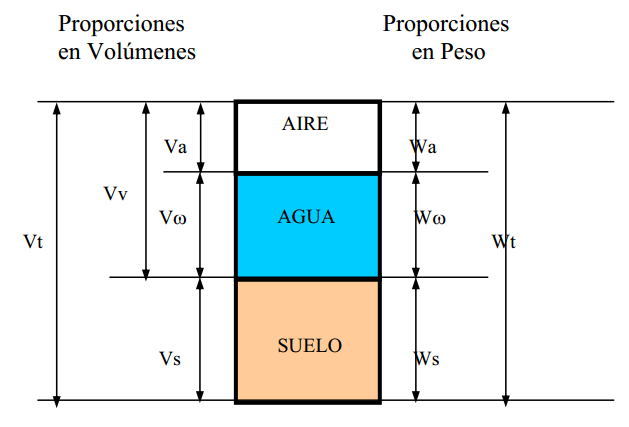
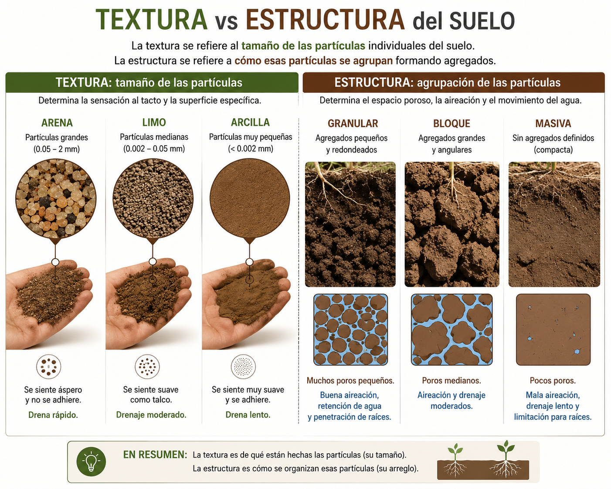
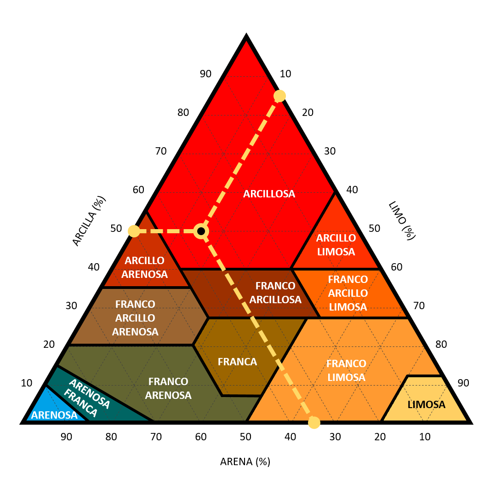
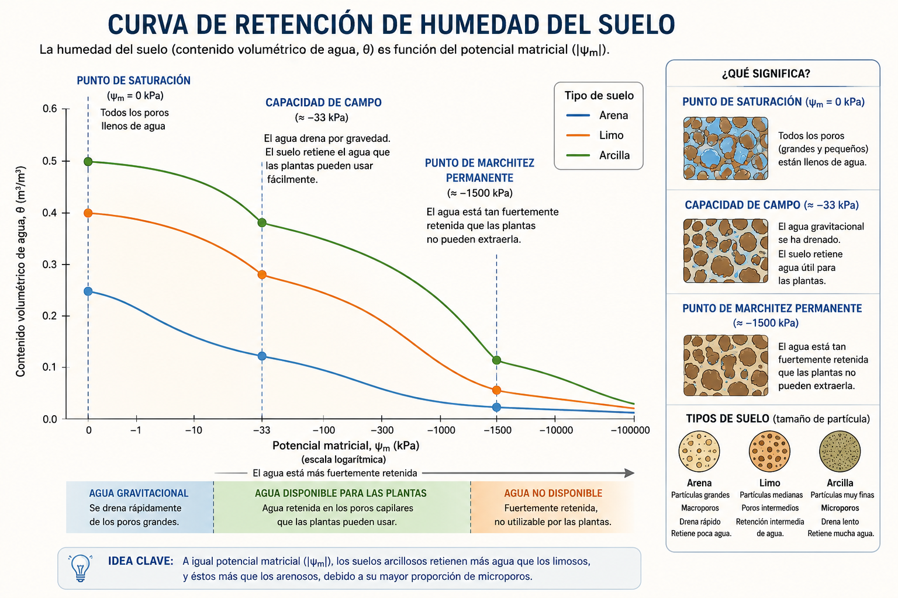
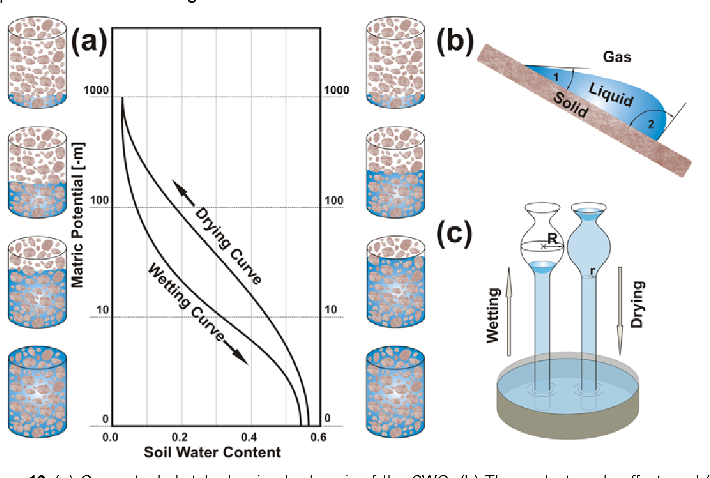

## Recapitulación: de la molécula al suelo {.center}

::: {style="font-size: 0.85em;"}
**Unidad 1 — Ideas fuerza:**  
- El agua es una molécula polar con propiedades excepcionales  
- El SPAC describe el camino del agua: Suelo → Planta → Atmósfera  
- El agua se mueve SIEMPRE de mayor a menor potencial hídrico  
- Chile central tiene déficit hídrico de ~1,000 mm/año → el riego es esencial  

**Ahora:** Vamos al primer compartimento del SPAC: **el suelo**.
:::

---

## Información de la sesión {.center}

| | |
|---|---|
| **Unidad** | 2 — El agua en el suelo |
| **Sesión** | 2.1 |
| **RAA** | RAA2, RAA3 |
| **Duración** | ~90 minutos |
| **Contenido** | Propiedades físicas e hidráulicas del suelo, energía del agua en el suelo |

---

## Objetivos de aprendizaje {.center}

Al finalizar esta sesión, serás capaz de:

1. Describir las propiedades físicas del suelo relevantes para la retención de agua
2. Explicar el concepto de energía del agua en el suelo (potencial hídrico del suelo)
3. Interpretar una curva característica de retención de agua para distintos suelos
4. Relacionar textura, estructura y porosidad con la capacidad de retención
5. Identificar los factores de manejo que modifican la retención de agua

---

## El suelo como reservorio de agua {.center}

El suelo es un sistema **trifásico**:

| Fase | Componente | % en volumen (ideal) | Función principal |
|------|-----------|---------------------|-------------------|
| Sólida | Minerales + MO | ~50% | Soporte, nutrientes, estructura |
| Líquida | Agua + solutos | ~25% | Transporte, nutrición, refrigeración |
| Gaseosa | Aire del suelo | ~25% | Respiración radical, actividad microbiana |

::: {style="margin-top: 1em; text-align: center; font-weight: bold;"}
La fase líquida es la que gestionamos con el riego
:::

## El suelo como reservorio de agua {.center}

{fig-align='center'}

---

## ¿Qué determina cuánta agua puede almacenar un suelo? {.center .smaller}

**Dos propiedades fundamentales:**

1. **Textura** — distribución de tamaño de partículas (arena, limo, arcilla)
   - Determina el área superficial total
   - Define la proporción de micro, meso y macroporos

2. **Estructura** — cómo se organizan esas partículas en agregados
   - Define la macroporosidad y conductividad hidráulica
   - Es modificable por manejo (labranza, MO, compactación)

::: {style="margin-top: 1em; font-weight: bold; text-align: center;"}
Textura ≈ lo que heredas | Estructura ≈ lo que manejas
:::

---

## Dos propiedades fundamentales

{fig-align="center"}

---

## Textura del suelo {.center}

**Definición:** Proporción relativa de arena, limo y arcilla en la fracción mineral (< 2 mm).

| Fracción | Diámetro (mm) | Área superficial relativa | Propiedades hídricas |
|----------|--------------|--------------------------|---------------------|
| Arena | 2.0 - 0.05 | 1× (referencia) | Baja retención, alta permeabilidad |
| Limo | 0.05 - 0.002 | ~100× | Retención media, capilaridad |
| Arcilla | < 0.002 | ~1,000-10,000× | Alta retención, carga eléctrica, adsorción |

::: {style="margin-top: 0.5em; font-size: 0.85em;"}
La arcilla tiene hasta **10,000 veces más área superficial** que la arena. Cada gramo de arcilla puede tener >700 m² de superficie.
:::

---

## Área superficial: la clave de la retención {.center}

::: {style="font-size: 0.9em;"}
El agua se adhiere a las superficies por **adsorción** (fuerzas electrostáticas).

| Textura | Área superficial (m²/g) | Retención |
|---------|------------------------|-----------|
| Arena gruesa | < 0.01 | Casi nula |
| Arena fina | 0.1 - 1 | Muy baja |
| Limo | 1 - 10 | Baja-media |
| Arcilla caolinita | 10 - 30 | Media-alta |
| Arcilla montmorillonita | 700 - 800 | Muy alta |
| Materia orgánica (humus) | 500 - 900 | Muy alta |

::: {style="margin-top: 0.5em; font-weight: bold; text-align: center;"}
Más superficie = más agua adsorbida = más agua retenida (pero no toda disponible)
:::

:::

---

## Las cargas eléctricas de las arcillas {.center}

Las arcillas tienen **carga eléctrica negativa permanente** en su superficie:

- **Sustitución isomórfica:** Al³⁺ reemplaza Si⁴⁺ en la capa tetraédrica → carga neta negativa
- Esta carga atrae cationes (Ca²⁺, Mg²⁺, K⁺, Na⁺) y moléculas de agua (dipolos)
- Se forma la **doble capa difusa**: capa de cationes hidratados adsorbidos

::: {style="margin-top: 1em; font-size: 0.85em;"}
**Consecuencia para el riego:** El agua cercana a la superficie de arcilla está fuertemente retenida (Ψm muy negativo) y NO está disponible para la planta. Por eso un suelo arcilloso retiene más agua total pero no toda es aprovechable.
:::

---

## Las cargas eléctricas de las arcillas {.center}

---

## Triángulo textural y clases texturales {.center}

::: {style="font-size: 0.9em;"}
Las **12 clases texturales** se determinan por % arena, % limo, % arcilla.

| Clase textural | Aptitud para retención de agua |
|---------------|-------------------------------|
| Arenoso / Arenoso-franco | Muy baja |
| Franco-arenoso | Baja |
| Franco | Media (ideal agrícola) |
| Franco-limoso | Media-alta |
| Franco-arcilloso | Alta |
| Arcilloso | Muy alta (pero baja disponibilidad relativa) |
:::

::: {style="margin-top: 1em;"}
**Regla práctica:** Los suelos **francos** tienen el mejor balance retención-disponibilidad.
:::

---

## Triángulo textural y clases texturales {.center}

{fig-align="center"}

---

## Estructura del suelo {.center .smaller}

**Definición:** Organización de partículas primarias en agregados (peds) con formas y tamaños definidos.

| Tipo estructural | Descripción | Efecto en el agua |
|-----------------|-------------|-------------------|
| **Granular** | Agregados esféricos pequeños (1-10 mm) | Excelente: buena infiltración y drenaje |
| **Bloques angulares** | Agregados cúbicos con caras planas | Buena: infiltración moderada |
| **Prismática** | Columnas verticales | Regular: puede canalizar agua |
| **Laminar** | Placas horizontales | Mala: restringe infiltración y raíces |
| **Sin estructura** | Masivo, partículas sueltas | Muy mala: compactación |

---

## Tamaño de poros y función {.center}

| Tipo de poro | Diámetro (μm) | Función | ¿Retiene agua disponible? |
|-------------|--------------|---------|--------------------------|
| **Macroporos** | > 30 | Drenaje, aireación, infiltración | No (drena por gravedad) |
| **Mesoporos** | 0.2 - 30 | **Retención de agua disponible** | **Sí** (capilaridad) |
| **Microporos** | < 0.2 | Retención de agua no disponible | No (adsorbida fuertemente) |

::: {style="margin-top: 1em; text-align: center; font-weight: bold;"}
Un suelo ideal tiene balance de los tres: drena el exceso, retiene lo útil, almacena reserva.
:::

---

## Energía del agua en el suelo {.center}

En la Unidad 1 vimos: $\Psi_{total} = \Psi_m + \Psi_o + \Psi_g + \Psi_p$

En el **suelo no saturado**, el potencial mátrico ($\Psi_m$) domina:

**Dos mecanismos de retención:**  
1. **Capilaridad:** agua retenida en poros por tensión superficial. La altura de ascenso capilar ∝ 1/diámetro del poro.  
2. **Adsorción:** agua unida electrostáticamente a superficies de arcilla y MO. Forma películas de pocas moléculas de espesor.  

::: {style="margin-top: 1em;"}
$\Psi_m$ es **siempre negativo** en suelo no saturado — el suelo "chupa" el agua.
:::

---

## Potencial mátrico: el concepto de succión {.center}

**Succión del suelo** = $-\Psi_m$ (valor positivo en kPa)

| Ψm (kPa) | Succión (kPa) | ¿Qué significa? |
|-----------|---------------|-----------------|
| 0 | 0 | Sin succión — suelo saturado |
| -10 | 10 | Succión baja — macroporos ya drenaron |
| -33 | 33 | **Capacidad de campo** |
| -100 | 100 | El agua solo está en mesoporos finos |
| -500 | 500 | Queda poca agua disponible |
| -1500 | 1500 | **PMP** — la planta no puede extraer más |

::: {style="margin-top: 1em; font-size: 0.85em;"}
La relación entre Ψm y θ es la **curva característica de retención** — la "huella digital hídrica" del suelo.
:::

---

## Curva característica de retención de agua {.center}

$$ \theta = f(\Psi_m) $$

**¿Qué nos dice la curva?**  
- Para cada Ψm → cuánta agua queda en el suelo (θ)  
- La forma de la curva depende de la textura y estructura  
- Dos suelos con la misma θ pueden tener distinto Ψm (distinta disponibilidad)

**Puntos clave en la curva:**  
- Ψm = 0 → Saturación (θ = porosidad total)  
- Ψm = -33 kPa → CC (θ = agua retenida contra gravedad)  
- Ψm = -1500 kPa → PMP (θ = agua no disponible)   

---

## Comparación de curvas por textura {.center}

::: {style="font-size: 0.9em;"}
| Ψm (kPa) | θ arenoso | θ franco | θ arcilloso |
|-----------|-----------|----------|-------------|
| 0 (Sat) | 0.42 | 0.48 | 0.55 |
| -33 (CC) | 0.12 | 0.30 | 0.40 |
| -1500 (PMP) | 0.03 | 0.11 | 0.21 |
| **ADT (CC-PMP)** | **0.09** | **0.19** | **0.19** |

**Observación clave:** El suelo arcilloso retiene más agua total que el arenoso, pero el franco y el arcilloso tienen el MISMO ADT. ¿Por qué? Porque el arcilloso también retiene más agua en PMP.
:::

---

## Curva característica de retención de agua {.center}

{fig-align="center"}
---

## Histéresis: secado ≠ humedecimiento {.center}

::: {style="font-size: 0.9em;"}
La curva de retención NO es única: depende de si el suelo se está secando o humedeciendo.

**Causas de la histéresis:**  
1. **Efecto "cuello de botella" (ink-bottle):** poros con entrada estrecha y cuerpo ancho. El agua entra fácil pero sale con dificultad.  
2. **Ángulo de contacto:** diferente en avance (mojado) vs. retroceso (secado).  
3. **Aire atrapado:** burbujas de aire que quedan ocluidas durante el humedecimiento.  

**Consecuencia práctica:** Para un mismo Ψm, el suelo en proceso de secado contiene MÁS agua que en proceso de humedecimiento.
:::

---

## Histéresis: secado ≠ humedecimiento {.center}

{fig-align='center'}

---

## Factores que afectan la retención de agua {.center}

| Factor | Efecto | Mecanismo |
|--------|--------|-----------|
| **↑ Arcilla** | ↑ Retención total, ↑ PMP | Mayor área superficial y microporosidad |
| **↑ Materia orgánica** | ↑↑ Agua disponible | MO retiene 3-5× su peso; crea mesoporos |
| **Buena estructura** | ↑ Agua disponible | Más mesoporos = más agua capilar |
| **Compactación** | ↓↓ Infiltración, ↓ agua disponible | Destruye macroporos; reduce porosidad total |
| **↑ Profundidad** | ↑ Reservorio total (mm) | Más volumen de suelo explorable |

---

## Materia orgánica: el mejor mejorador de la retención {.center}

::: {style="font-size: 0.9em;"}
La MO es el factor de manejo más potente para mejorar la retención de agua:

| Efecto de ↑ 1% de MO | Suelo arenoso | Suelo franco | Suelo arcilloso |
|----------------------|--------------|-------------|-----------------|
| ↑ Agua disponible | +15-20 mm/m | +10-15 mm/m | +5-10 mm/m |
| ↑ Capacidad de campo | +2-4% θv | +1-3% θv | +1-2% θv |

**Mecanismo:** La MO forma agregados estables → crea mesoporosidad. Además, el humus adsorbe agua (superficie ~700 m²/g).

**Práctica:** Incorporar rastrojos, compost, abonos verdes, reducir labranza.
:::

---

## Compactación: el enemigo del agua en el suelo {.center}

::: {style="font-size: 0.9em;"}
**La compactación reduce la porosidad total y elimina macroporos:**

| Indicador | Suelo no compactado | Suelo compactado | Cambio |
|-----------|-------------------|-----------------|--------|
| Da (g/cm³) | 1.35 | 1.70 | ↑ 26% |
| Porosidad (%) | 49 | 36 | ↓ 27% |
| Infiltración (mm/h) | 25 | 5 | ↓ 80% |
| ADT (mm/m) | 190 | 140 | ↓ 26% |

**Causas:** Tráfico de maquinaria pesada, labranza repetida a misma profundidad (pie de arado), sobrepastoreo.

**Solución:** Labranza vertical, subsolado, cultivos de raíz profunda, control de tráfico.
:::

---

## Caso chileno: suelos de la zona central {.center}

| Serie de suelo | Textura superficial | Da (g/cm³) | CC (cm³/cm³) | PMP (cm³/cm³) | ADT (cm³/cm³) |
|---------------|-------------------|------------|-------------|--------------|--------------|
| Santiago | Franco | 1.32 | 0.30 | 0.14 | 0.16 |
| Maipo | Franco-arenoso | 1.45 | 0.22 | 0.09 | 0.13 |
| Colina | Franco-arcilloso | 1.20 | 0.35 | 0.18 | 0.17 |
| Chicureo | Arenoso-franco | 1.55 | 0.18 | 0.06 | 0.12 |

::: {style="font-size: 0.75em; margin-top: 0.5em; color: #888;"}
Datos orientativos. Fuente: CIREN, Estudio Agrológico RM.
:::

---

## Ejercicio en clase {.center}

**Problema:** Compara dos suelos de un mismo predio:

| Propiedad | Suelo A | Suelo B |
|-----------|---------|---------|
| Textura | Franco-arenoso | Franco-arcilloso |
| Da (g/cm³) | 1.50 | 1.15 |
| CC (cm³/cm³) | 0.20 | 0.38 |
| PMP (cm³/cm³) | 0.07 | 0.19 |
| MO (%) | 1.2 | 3.5 |

**Responda:**
1. ¿Cuál tiene más agua total a CC? ¿Y más agua disponible (ADT)?
2. ¿Qué explica la diferencia de MO?
3. Si Ud. fuera a cultivar lechugas (p=0.30), ¿en cuál suelo regaría menos frecuentemente?

---

## Vocabulario clave {.center}

| Término | Definición |
|---------|-----------|
| Textura | Proporción de arena, limo y arcilla |
| Estructura | Organización de partículas en agregados |
| Área superficial específica | Superficie total por gramo de suelo (m²/g) |
| Potencial mátrico (Ψm) | Energía del agua debida a la matriz del suelo |
| Curva característica | Relación θ(Ψm) — huella digital hídrica |
| Histéresis | Diferencia entre curva de secado y humedecimiento |
| Mesoporos | Poros de 0.2-30 μm que retienen agua disponible |

---

## Resumen de conceptos clave {.center}

1. El suelo es **trifásico**: sólidos (50%), agua (25%), aire (25%)

2. La **textura** define el área superficial y la distribución de tamaños de poro

3. La **estructura** define la macroporosidad — es modificable por manejo

4. El **potencial mátrico** ($\Psi_m$) es la fuerza con que el suelo retiene el agua — más negativo = más seco

5. La **curva característica** $\theta(\Psi_m)$ es única para cada suelo: define cuánta agua hay a cada succión

6. Los puntos clave: **Saturación (0 kPa) → CC (-33 kPa) → PMP (-1500 kPa)**

7. La **materia orgánica** es la herramienta más efectiva para mejorar la retención de agua disponible

---

## Para la próxima sesión {.center}

**Sesión 2.2:** Relaciones masa-volumen de suelo

→ Densidad aparente (Da), densidad real (Dr), porosidad total.
→ ¿Cómo medimos cuantitativamente lo que hoy describimos cualitativamente?

**Taller 1** (Google Colab): Abre `taller-01.ipynb` — huella hídrica + Da + porosidad.

---

## Preguntas de autoevaluación {.center}

1. ¿Por qué un suelo arcilloso retiene más agua total que uno arenoso, pero no necesariamente más agua disponible?

2. ¿Cuál es la diferencia entre textura y estructura? ¿Cuál de las dos puede modificar un agricultor?

3. ¿Qué significa que el potencial mátrico sea -100 kPa? ¿Está el suelo húmedo o seco?

4. ¿Por qué la curva de retención tiene histéresis? ¿Qué implicancia práctica tiene?

5. ¿Cómo afecta aumentar 1% la materia orgánica en un suelo arenoso? Dé valores concretos.

6. Un suelo tiene estructura laminar en superficie. ¿Qué problema de infiltración esperaría?

7. Dibuje aproximadamente las curvas de retención de un suelo arenoso, uno franco y uno arcilloso en un mismo gráfico θ vs. log(Ψm).
