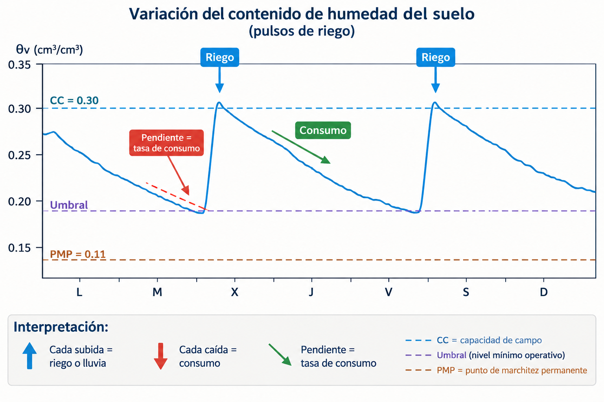

```{r}
#| include: false
source("../_common.R")
```

## Recapitulación {.center}

::: {style="font-size: 0.85em;"}
**Sesión 2.3 — Lo que aprendimos:**  
- θg = (Mh - Ms)/Ms; θv = θg × Da; Lámina (mm) = θv × Z  
- CC = θv a -33 kPa = límite superior de agua disponible  
- PMP = θv a -1500 kPa = límite inferior  
- ADT = CC - PMP  

**Hoy:** ¿Toda esa agua está igualmente disponible? No. → AFA + monitoreo.
:::

---

## Información de la sesión {.center}

| | |
|---|---|
| **Unidad** | 2 — El agua en el suelo |
| **Sesión** | 2.4 |
| **RAA** | RAA3, RAA4 |
| **Duración** | ~90 minutos |
| **Contenido** | ADT, AFA, monitoreo de humedad del suelo, interpretación de datos |

---

## Objetivos de aprendizaje {.center}

Al finalizar esta sesión, serás capaz de:

1. Calcular el Agua Disponible Total (ADT) por horizonte y perfil completo
2. Calcular el Agua Fácilmente Aprovechable (AFA) para distintos cultivos
3. Determinar el umbral y momento óptimo de riego
4. Convertir θv a lámina de riego neta y bruta
5. Conocer los principales métodos de monitoreo de humedad y sus aplicaciones
6. Interpretar series temporales de datos de sensores de humedad

---

## Agua Disponible Total (ADT): definición y cálculo {.center .smaller}

$$ADT = CC - PMP \quad [\text{cm}^3/\text{cm}^3]$$

**Para un horizonte de espesor Z (mm):**

$$L_{ADT} = (CC - PMP) \times Z \quad [\text{mm}]$$

**Para el perfil completo:** Sumar las láminas de todos los horizontes.

$$L_{ADT,total} = \sum_{i=1}^{n} (CC_i - PMP_i) \times Z_i$$

---

## Ejemplo: ADT por horizonte y perfil {.center .smaller}

| Horizonte | Z (cm) | CC | PMP | ADT (v/v) | L_ADT (mm) |
|-----------|--------|-----|------|-----------|------------|
| A (0-25) | 25 | 0.32 | 0.14 | 0.18 | 0.18 × 250 = 45 |
| B (25-60) | 35 | 0.28 | 0.16 | 0.12 | 0.12 × 350 = 42 |
| C (60-100) | 40 | 0.22 | 0.15 | 0.07 | 0.07 × 400 = 28 |
| **Total** | **100** | | | | **115** |

**Interpretación:** En 1 metro de suelo hay 115 mm de agua que la planta PUEDE usar.

Si ETc = 6 mm/día → 115 / 6 = **19 días** hasta agotar el ADT desde CC.

---

## ¿Por qué no podemos usar todo el ADT? {.center .smaller}

**El agua no está igualmente disponible a lo largo de todo el rango CC → PMP:**

- Cerca de CC: agua fácil de extraer (Ψm ≈ -33 a -100 kPa)
- En el medio: la planta empieza a hacer esfuerzo (Ψm ≈ -100 a -500 kPa)
- Cerca de PMP: agua MUY difícil de extraer (Ψm ≈ -500 a -1500 kPa) — la planta gasta energía, cierra estomas, reduce crecimiento

::: {style="margin-top: 1em; font-weight: bold; text-align: center;"}
**Antes de llegar a PMP, el cultivo YA está sufriendo estrés hídrico que reduce rendimiento.**
:::

---

## Agua Fácilmente Aprovechable (AFA) {.center .smaller}

$$AFA = ADT \times p$$

Donde $p$ = **fracción de agotamiento permisible** (fracción del ADT que podemos consumir sin causar estrés).

| Cultivo | p | Sensibilidad | ¿Por qué? |
|---------|---|-------------|-----------|
| Lechuga, espinaca | 0.25-0.35 | **Muy alta** | Sistema radical superficial, tejido con mucha agua |
| Papa | 0.30-0.40 | Alta | Tubérculo sensible al estrés hídrico |
| Maíz (grano) | 0.50-0.55 | Media | Raíz profunda, cierta tolerancia |
| Vid (vino tinto) | 0.40-0.50 | Media | Se busca cierto estrés para calidad |
| Trigo | 0.55-0.60 | Media-baja | Cultivo extensivo, raíz profunda |
| Alfalfa | 0.55-0.65 | Baja | Raíz muy profunda (>2 m), perenne |

---

## Ejemplo: cálculo de AFA {.center .smaller}

**Datos:**  
- ADT del perfil: 115 mm  
- Cultivo: maíz (p = 0.50)  

$$AFA = 115 \times 0.50 = 57.5 \text{ mm}$$

**Interpretación para el manejo del riego:**  
- El suelo almacena 115 mm que la planta PUEDE extraer  
- Pero solo 57.5 mm deben consumirse antes de regar  
- Los otros 57.5 mm son **reserva de seguridad** — NUNCA deben agotarse  
- Regar cuando el cultivo haya consumido ≈ 57.5 mm  

::: {style="font-size: 0.8em; margin-top: 0.5em;"}
Si ETc = 6 mm/día → regar aproximadamente cada 57.5/6 ≈ 9-10 días.
:::

---

## Umbral de riego: ¿cuándo regar exactamente? {.center .smaller}

**Dos formas equivalentes de calcular el umbral:**

$$\theta_{umbral} = CC - AFA$$

$$\theta_{umbral} = PMP + (1-p) \times ADT$$

**Ejemplo (maíz, perfil anterior):**  

CC promedio = (0.32×25 + 0.28×35 + 0.22×40)/100 = 0.266 cm³/cm³

AFA promedio = 0.115 × 0.50 = 0.0575 cm³/cm³

$$\theta_{umbral} = 0.266 - 0.0575 = 0.2085 \text{ cm}^3/\text{cm}^3$$

::: {style="margin-top: 1em; text-align: center; font-weight: bold;"}
Regar cuando θv del perfil baje de ~0.209 (≈ 57.5 mm consumidos desde CC)
:::


---

## El reservorio de agua del perfil {.center}

```{r}
#| fig-width: 9
#| fig-height: 3.8
#| fig-align: center
pmp <- 0.151; umbral <- 0.2085; cc <- 0.266
res <- tibble(
  zona = factor(c("No disponible", "Reserva (ADT − AFA)", "AFA"),
                levels = c("AFA", "Reserva (ADT − AFA)", "No disponible")),
  ini = c(0, pmp, umbral), fin = c(pmp, umbral, cc)
) |> mutate(mm = (fin - ini) * 1000, mid = (ini + fin) / 2,
            lab = sprintf("%s\n%s mm", gsub(" (", "\n(", as.character(zona), fixed = TRUE), sub("\\.0$", "", sprintf("%.1f", mm))))
f2 <- ggplot(res) +
  geom_rect(aes(xmin = ini, xmax = fin - 0.001, ymin = 0, ymax = 1, fill = zona)) +
  geom_text(aes(x = mid, y = 0.5, label = lab), size = 5,
            colour = c(col_texto, col_texto, "white")) +
  geom_segment(data = tibble(x = c(pmp, umbral, cc)), aes(x = x, xend = x, y = 1, yend = 1.18),
               colour = col_texto2) +
  annotate("text", x = c(pmp, umbral, cc), y = 1.22, vjust = 0, size = 4.8, colour = col_texto,
           label = c("PMP\n0.151", "Umbral de riego\n0.209", "CC\n0.266")) +
  scale_fill_manual(values = c("AFA" = col_agua[4], "Reserva (ADT − AFA)" = col_agua[2], "No disponible" = "#e6e5e1")) +
  scale_x_continuous(limits = c(0, 0.3), breaks = seq(0, 0.3, 0.05)) +
  scale_y_continuous(limits = c(0, 1.55)) +
  labs(x = "θv promedio del perfil (cm³/cm³)  ·  láminas en 1 m de suelo", y = NULL) +
  theme(legend.position = "none", axis.text.y = element_blank(), panel.grid.major.y = element_blank())
f2
```

::: {style="font-size: 0.8em; text-align: center;"}
Maíz (p = 0.50) en el perfil del ejemplo: se riega al cruzar el umbral y se reponen los 57.5 mm de AFA. La reserva no se toca.
:::

---

## De umbral a decisión de riego {.center .smaller}

**Lámina neta a reponer (cuando estamos en el umbral):**
$$L_n = AFA = 57.5 \text{ mm}$$

**Lámina bruta (considerando eficiencia del sistema):**
$$L_b = \frac{L_n}{E_a}$$

| Sistema de riego | Ea | Lb para 57.5 mm netos |
|-----------------|----|----------------------|
| Surco | 0.55 | 104.5 mm |
| Aspersión | 0.75 | 76.7 mm |
| Goteo | 0.90 | 63.9 mm |
| Goteo subsuperficial | 0.93 | 61.8 mm |

::: {style="margin-top: 0.5em; font-size: 0.85em;"}
La eficiencia importa: con riego por surco hay que aplicar **casi el doble** que con goteo.
:::

---

## Ejercicio integrador 1 {.center .smaller}

| Horizonte | Z (cm) | CC (cm³/cm³) | PMP (cm³/cm³) |
|-----------|--------|-------------|--------------|
| Ap (0-30) | 30 | 0.34 | 0.15 |
| Bt (30-70) | 40 | 0.30 | 0.18 |
| C (70-100) | 30 | 0.24 | 0.14 |

**Calcule:**  
1. ADT por horizonte (cm³/cm³) y lámina total (mm)  
2. AFA para vid vinífera (p = 0.45)  
3. Lámina bruta si se riega por goteo (Ea = 0.90)  
4. Frecuencia de riego si ETc = 4.8 mm/día  

::: {style="font-size: 0.8em; text-align: center; margin-top: 0.5em;"}
Resuelva en 8 minutos.
:::

::: {.notes}
1. ADT: Ap = 0.19 (57 mm); Bt = 0.12 (48 mm); C = 0.10 (30 mm) → total 135 mm. 2. AFA = 135 × 0.45 = 60.8 mm. 3. Lb = 60.8 / 0.90 = 67.5 mm. 4. Frecuencia = 60.8 / 4.8 = 12.7 → regar cada 12 días (se redondea hacia abajo para no pasar el umbral). Es el mismo perfil de la Parte 5 del Taller 2 (allí con maíz, p = 0.50).
:::

---

## Monitoreo de humedad: ¿por qué medir? {.center .smaller}

**El cálculo de balance hídrico (ETc - P) es una estimación. Medir da certeza.**

| Método de decisión | Ventaja | Limitación |
|-------------------|---------|------------|
| **Calendario fijo** | Simple | Ignora variabilidad climática y del cultivo |
| **Balance hídrico** | Basado en ET real | Requiere datos meteorológicos; acumula errores |
| **Monitoreo del suelo** | Mide el agua REALMENTE disponible | Costo del equipo; requiere interpretación |
| **Monitoreo de la planta** | Mide la respuesta REAL de la planta; detecta estrés antes del daño visible | Laborioso; requiere umbrales por cultivo y hora de medición |

**Recomendación:** Combinar balance hídrico (planificación) + monitoreo de suelo (verificación).

---

## Métodos de monitoreo de humedad del suelo {.center .smaller}

| Método | ¿Qué mide? | Precisión | Costo (CLP) | Automatizable |
|--------|-----------|----------|------------|--------------|
| **Gravimétrico** | θg → θv | Alta (referencia) | $0 (mano de obra) | No |
| **Tensiómetro** | Ψm (kPa) | Media | $30-80 mil | Parcial |
| **FDR / Capacitivo** | θv (Ka del suelo) | Media-alta | $100-500 mil | **Sí** |
| **TDR** | θv (Ka del suelo) | Alta | $500-2M | **Sí** |
| **Sonda de neutrones** | θv (H atenuado) | Muy alta | $5-15M | No (operador) |
| **Sonda de neutrones cósmicos (CRNS)** | θv promedio de área grande (~10-20 ha) | Alta | Muy alto | Sí |

---

## Sensores FDR/TDR: fundamento {.center .smaller}

**Principio físico:** Miden la constante dieléctrica aparente del suelo (Ka).

| Material | Ka | Contribución a la señal |
|----------|----|------------------------|
| Aire | 1 | Baja (seco) |
| Partículas del suelo | 3-5 | Constante |
| **Agua** | **~80** | **Domina** |

→ Ka del suelo depende principalmente de θv. Si Ka sube → hay más agua.

**Diferencia FDR vs. TDR:**  
- **FDR (Frequency Domain Reflectometry):** mide la capacitancia a una frecuencia fija. Más barato, algo menos preciso.  
- **TDR (Time Domain Reflectometry):** mide el tiempo de viaje de un pulso electromagnético. Más caro, mayor precisión.

---

## Ejercicio rápido: sensores {.center .smaller}

1. ¿Qué propiedad física mide un sensor FDR/TDR?
2. ¿Por qué el agua "domina" la señal del sensor?
3. ¿Qué mide directamente el tensiómetro que los FDR/TDR no?

::: {style="font-size: 0.8em; text-align: center; margin-top: 1em;"}
Resuelve en 3 minutos.
:::

::: {.notes}
1. La constante dieléctrica aparente (Ka). 2. Ka del agua ≈ 80, vs 1 (aire) y 3–5 (sólidos). 3. El potencial mátrico Ψm (lo que "siente" la raíz).
:::

---

## Tensiómetro: midiendo Ψm directamente {.center .smaller}

**Componentes:**  
- Cápsula porosa cerámica (permite paso de agua, no de aire)  
- Tubo lleno de agua conectado a un vacuómetro o transductor de presión  
- Se entierra a la profundidad deseada  

**Funcionamiento:**  
- Suelo seco → "chupa" agua del tensiómetro → vacío interno → lectura de succión  
- Suelo húmedo → agua del suelo entra al tensiómetro → vacío disminuye

**Rango útil:** 0 a -80 kPa. Más allá, entra aire por la cápsula y pierde precisión.

::: {style="font-size: 0.85em; margin-top: 0.5em;"}
Ventaja: mide Ψm directamente (lo que la raíz "siente"). Desventaja: mantenimiento (rellenar agua), rango limitado.
:::

---

## Instalación de sensores en campo {.center}

**Profundidades típicas de instalación:**

| Profundidad | ¿Qué mide? | ¿Para qué sirve? |
|------------|-----------|-----------------|
| 15-20 cm | Zona de mayor actividad radical superficial | Detectar estrés temprano |
| 30-40 cm | Zona media de raíces | Dónde está el agua realmente |
| 60-80 cm | Zona profunda | Detectar drenaje profundo o ascenso capilar |

**Regla de oro:** Instalar al menos a **2 profundidades** — una en la zona de máxima densidad radical y otra en el fondo del perfil.

---

## Interpretación de series temporales de humedad {.center .smaller}

{fig-align="center"}

**Interpretación:** Cada caída = consumo. Cada subida = riego o lluvia. Pendiente = tasa de consumo.

---

## ¿Qué nos dice la pendiente de la curva? {.center .smaller}

| Patrón en la serie | Interpretación |
|-------------------|----------------|
| Caída lineal suave (pendiente constante) | Consumo estable del cultivo (ETc constante) |
| Caída que se aplana | El suelo se está secando → menor conductividad → menor extracción |
| Caída más pronunciada | Aumento de ETc (ola de calor, más demanda evaporativa) |
| Subida brusca | Riego o lluvia |
| Subida gradual | Posible ascenso capilar desde nivel freático |
| Caída en profundidad sin caída superficial | Las raíces profundas están consumiendo; superficial ya está seco |
| Meseta horizontal | Cultivo dejó de consumir (estrés severo, senescencia, o cosecha) |

---

## Una semana de datos de sensores {.center}

```{r}
#| fig-width: 9
#| fig-height: 5
#| fig-align: center
serie <- tibble(
  dia = factor(rep(c("L", "M", "X", "J", "V", "S", "D"), 2), levels = c("L", "M", "X", "J", "V", "S", "D")),
  prof = rep(c("20 cm", "50 cm"), each = 7),
  theta = c(0.32, 0.29, 0.38, 0.34, 0.31, 0.28, 0.25, 0.28, 0.27, 0.28, 0.27, 0.26, 0.25, 0.24)
)
fin <- serie |> filter(dia == "D")
f3 <- ggplot(serie, aes(dia, theta, colour = prof, shape = prof, group = prof)) +
  geom_hline(yintercept = c(0.33, 0.14), linetype = "dashed", colour = col_ref) +
  annotate("text", x = 0.6, y = c(0.33, 0.14), label = c("CC = 0.33", "PMP = 0.14"),
           vjust = -0.5, hjust = 0, colour = col_texto2, size = 4.5) +
  geom_line(linewidth = 1) +
  geom_point(size = 3.5) +
  geom_text(data = fin, aes(label = prof), hjust = -0.3, vjust = c(-0.2, 1.2), size = 5, show.legend = FALSE) +
  scale_colour_manual(values = col_serie[1:2]) +
  scale_shape_manual(values = c(16, 15)) +
  scale_x_discrete(expand = expansion(add = c(0.4, 1))) +
  scale_y_continuous(limits = c(0.12, 0.40), breaks = seq(0.15, 0.40, 0.05)) +
  labs(x = "Día de la semana", y = "θv (cm³/cm³)") +
  theme(legend.position = "none")
f3
```

::: {style="font-size: 0.8em; text-align: center;"}
Maíz, sensores FDR a 20 y 50 cm. Usa este gráfico y la tabla del ejercicio siguiente.
:::

---

## Ejercicio de interpretación {.center .smaller}

**Lecturas diarias de θv (cm³/cm³) a 20 cm y 50 cm durante una semana:**

| Día | L | M | X | J | V | S | D |
|-----|---|---|---|---|---|---|---|
| θv_20cm | 0.32 | 0.29 | 0.38 | 0.34 | 0.31 | 0.28 | 0.25 |
| θv_50cm | 0.28 | 0.27 | 0.28 | 0.27 | 0.26 | 0.25 | 0.24 |

**CC = 0.33, PMP = 0.14, p = 0.50 (maíz)**

**Responda:**  
1. ¿Hubo un riego? ¿Qué día? ¿A qué profundidad llegó?  
2. ¿Cuánto consumió el cultivo entre el miércoles y el domingo a 20 cm?  
3. ¿Está el cultivo en estrés al final de la semana?  
4. ¿Recomendaría regar el lunes? Justifique.  

::: {.notes}
1. Sí, riego el miércoles (20 cm: 0.29 → 0.38). A 50 cm casi no hay cambio (0.27 → 0.28): el frente de mojado apenas llegó a esa profundidad. 0.38 > CC: exceso temporal que drena en ~1 día. 2. Δθ a 20 cm entre X y D = 0.38 − 0.25 = 0.13 cm³/cm³; pero 0.05 (0.38 → 0.33) es drenaje sobre CC. Consumo real desde CC ≈ 0.08 cm³/cm³ en 4 días (≈ 0.02/día). 3. Umbral = CC − p × ADT = 0.33 − 0.50 × 0.19 = 0.235. El domingo θv = 0.25 (20 cm) y 0.24 (50 cm): aún sobre el umbral, sin estrés, pero muy cerca. 4. Sí: a ~0.03/día, el lunes 20 cm estará en ~0.22, bajo el umbral. Regar el lunes (o el domingo por la tarde) y con lámina suficiente para mojar hasta 50 cm.
:::

---

## Calibración de sensores de humedad {.center .smaller}

::: {style="font-size: 0.9em;"}
Los sensores FDR/TDR miden Ka (constante dieléctrica), no θv directamente. Necesitan **calibración**.

**Ecuación de calibración típica:**

$$\theta_v = a \times \sqrt{Ka} + b$$

**¿Por qué calibrar?**  
- Cada suelo tiene distinta mineralogía → distinta Ka para igual θv  
- Suelos con arcilla 2:1 (montmorillonita) o salinos requieren calibración específica  
- La calibración de fábrica puede tener errores de ±0.03-0.05 cm³/cm³  

**Método de calibración en campo:**  
1. Instalar el sensor y tomar lectura de Ka  
2. Extraer muestra de suelo justo al lado del sensor  
3. Medir θv por método gravimétrico (referencia)  
4. Repetir a distintas humedades (después de riego, varios días después)  
5. Ajustar regresión $\theta_v = f(Ka)$  
:::

---

## Ventajas y desventajas de los métodos de monitoreo {.center .smaller}

| Método | Ventaja principal | Desventaja principal | ¿Cuándo usarlo? |
|--------|------------------|---------------------|-----------------|
| Gravimétrico | Precisión absoluta, sin calibración | Destructivo, lento, no continuo | Calibración de sensores, investigación |
| Tensiómetro | Mide Ψm (lo que "siente" la raíz) | Rango limitado (-80 kPa máx.), mantenimiento | Programación de riego en suelo franco |
| FDR | Bajo costo, continuo, automatizable | Menor precisión, sensible a salinidad | Monitoreo operativo de riego |
| TDR | Alta precisión, estable en el tiempo | Mayor costo | Investigación, cultivos de alto valor |
| Sonda de neutrones | Gran volumen de medición, alta precisión | Regulación estricta (fuente radiactiva) | Investigación, grandes predios |

---

## Ejercicio integrador 2 {.center .smaller}

| Horizonte | Z (cm) | CC | PMP |
|-----------|--------|-----|------|
| Ap (0-25) | 25 | 0.34 | 0.14 |
| Bt (25-65) | 40 | 0.29 | 0.17 |
| C (65-100) | 35 | 0.23 | 0.13 |

**Datos adicionales:**  
- Cultivo: trigo (p = 0.55)  
- Sistema de riego: pivote central (Ea = 0.82)  
- ETc actual: 5.2 mm/día  

**Calcule:**  
1. ADT total del perfil (mm)  
2. AFA para trigo (mm)  
3. Lámina bruta a aplicar  
4. Frecuencia de riego (días entre riegos)  
5. Umbral de θv para decidir el riego  

::: {.notes}
1. ADT: Ap = 0.20 × 250 = 50 mm; Bt = 0.12 × 400 = 48 mm; C = 0.10 × 350 = 35 mm → 133 mm. 2. AFA = 133 × 0.55 = 73.2 mm. 3. Lb = 73.2 / 0.82 = 89.2 mm. 4. 73.2 / 5.2 = 14.1 → cada 14 días. 5. CC promedio = (0.34×25 + 0.29×40 + 0.23×35)/100 = 0.2815; AFA promedio = 73.2 mm / 1000 mm = 0.0732 → umbral = 0.2815 − 0.0732 ≈ 0.208 cm³/cm³.
:::

---

## Resumen de conceptos clave {.center .smaller}

1. **ADT** = CC − PMP → agua total que el suelo puede almacenar para la planta (mm en el perfil)

2. **AFA** = ADT × p → agua que realmente debemos manejar sin causar estrés al cultivo

3. **Umbral de riego** = CC − AFA → θv al cual debemos regar

4. **Lámina neta = AFA; Lámina bruta = Ln / Ea** — la eficiencia del sistema determina cuánto aplicar

5. **FDR/TDR** miden θv vía constante dieléctrica (Ka ≈ 80 para agua)

6. **Interpretar la serie temporal** de θv permite: detectar riegos, cuantificar consumo (pendiente), identificar estrés

7. **La mejor estrategia** = balance hídrico (planificar) + sensores (verificar)

---

## Próxima unidad {.center}

::: {style="font-size: 1.2em; text-align: center;"}
**Unidad 3 — El agua en la planta**
:::

::: {style="margin-top: 1em; text-align: center;"}
Ya sabemos cuánta agua hay en el suelo y cuándo regar...

→ ¿Cómo absorbe el agua la planta?  
→ ¿Cómo la transporta desde la raíz hasta las hojas?  
→ ¿Qué controla la pérdida de agua por transpiración?  
:::

---

## Preguntas de autoevaluación {.center .smaller}

1. Calcule ADT y AFA (p=0.5) para un perfil de 80 cm con CC=0.30 cm³/cm³ y PMP=0.12 cm³/cm³ uniforme.

2. ¿Por qué AFA < ADT? ¿Qué pasaría si un agricultor usara ADT como criterio de riego?

3. Un tensiómetro marca -50 kPa en suelo franco. ¿Está cerca del umbral de riego para maíz (p=0.5)? Asuma CC=-33 kPa, PMP=-1500 kPa.

4. Compare TDR, FDR y gravimétrico como métodos de monitoreo. Ventajas y desventajas de cada uno.

5. En el gráfico de series temporales: ¿cómo distingue un evento de riego de un evento de lluvia?

6. ¿Por qué se recomienda instalar sensores a al menos 2 profundidades? ¿Qué información adicional entrega la profundidad mayor?

7. Calcule: un perfil tiene ADT=130 mm, p=0.45 (vid), Ea=0.88 (goteo), ETc=4.5 mm/día. Determine AFA, Lb, frecuencia de riego y umbral de θv (asuma CC promedio=0.30).
